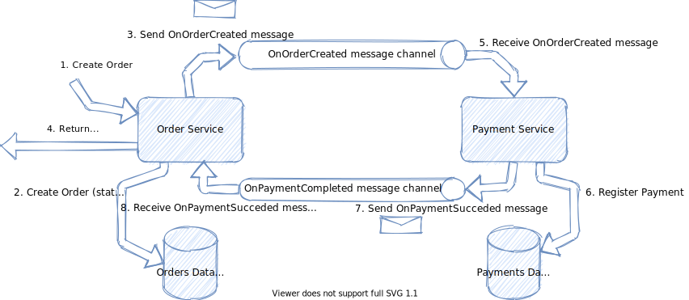

[](https://github.com/like-a-charm/ZapMicro.TransactionalOutbox/actions/workflows/build_and_test.yml)
# ZapMicro.TransactionalOutbox

[Repository](https://github.com/like-a-charm/ZapMicro.TransactionalOutbox) | [Nuget Package](https://www.nuget.org/packages/ZapMicro.TransactionalOutbox/)

ZapMicro.TransactionalOutbox is an implementation of the Transactional Outbox pattern for .NET Core and Entity Framework Core.
## Table of contents

1. [The Transactional Outbox pattern](#the-transactional-outbox-pattern)
2. [Installation](#configuration)
3. [Usage](#usage)
    1. [Defining the DbContext](#defining-the-dbcontext)
    2. [Implementing the Outbox Messages](#implementing-the-outbox-messages)
    3. [Implementing the Message Handlers](#implementing-the-message-handlers)
    4. [Configuring](#configuring)
    5. [Enqueuing an Outbox Message](#enqueuing-an-outbox-message)
    6. [Samples](#samples)
4. [Contributing](#contributing)

## The Transactional Outbox pattern

In the world of microservices, the Transactional Outbox pattern helps to guarantee the data consistency between different microservices that communicate through asynchronous messages.

### The scenario

Consider an e-commerce system and its order and payment microservices.
When a user submits an order, it is created in _Pending_ status until the payment is processed. Once the payment is processed the order status will be updated to 
 - _Confirmed_, if the payment succeeded
 - _Rejected_, if the payment failed

When implementing the system it's important to guarantee consistency between the order status and the payment processing.
The _Saga_ pattern provides a mechanism to guarantee consistency across different microservices based on asynchronous messages handled by a message broker.

The following picture describes an example of _create-order_ saga

 ***Figure 1**: create-order saga example*

The create-order saga of the figure above consists of the following steps:
1. An order is created through synchronous communication (e.g. REST API)
2. The order record is inserted in the database, the order status is initially set to _Pending_
3. An _OnOrderCreated_ message is sent to the message broker
4. The pending order is returned to the client
5. The message broker delivers the _OnOrderCreated_ message to the Payment Service
6. The payment service processes the payment and, if it succeeds, it ir recorded in the database
7. If the payment succeeded an _OnPaymentSucceeded_ message is sent to the message broker
8. The message broker delivers the _OnPaymentSucceeded_ message to the Order Service
9. The order service updates the order status to _Confirmed_

If the payment cannot be processed then the payment service will produce an _OnPaymentFailed_ message and when the order service receives the message it will update the order status to _Rejected_

### The problem

Although the Saga pattern coordinates the distributed transaction across the two microservices it is still possible to fall in inconsistent scenarios.
For instance, a system crush of the payment service may occur after the local transaction is committed and before the _OnPaymentSucceeded_ message is delivered to the message broker.
In this case the payment has been correctly processed but the order state will remain set to _Pending_.

### The solution

With the Transactional Outbox pattern an _Outbox Messages_ table is kept within each database and the local transactions will
- create/update the entity in the database
- crete the outbox message

A message relay will then be responsible of dequeuing the outbox message and send it to the message broker.

## Installation

Install using the [ZapMicro.TransactionalOutbox package](https://www.nuget.org/packages/ZapMicro.TransactionalOutbox/)

```
PM> Install-Package ZapMicro.TransactionalOutbox
```

## Usage

When you install the package, it should be added to your _csproj_ file. Alternatively, you can add it directly by adding:

```xml
<PackageReference Include="ZapMicro.TransactionalOutbox" Version="1.0.0" />
```

### Defining the DbContext

Start with letting your `DbContext` class implement the `ITransactionalOutboxDbContext` interface.
The `ITransactionalOutboxDbContext` interface exposes only one property: `DbSet<OutboxMessage> OutboxMessages { get; }`

```c#
public class OrderServiceDbContext: DbContext, ITransactionalOutboxDbContext
{
    //implement the OutboxMessages property from ITransactionalOutboxDbContext interface
    public DbSet<OutboxMessage> OutboxMessages { get; }
    
    //add all the other DbSets needed by the application
    public DbSet<Order> Orders { get; }
}
```
### Implementing the Outbox Messages

Define an implementation of `IOutboxMessage` for each message that the application have to send to the message broker and add all the properties needed to create and raise the domain message.

```c#
public class OnOrderCreatedOutboxMessage: IOutboxMessage
{
    public Guid OrderId { get; set; }
    public double OrderTotal { get; set; }
} 
```

### Implementing the Message Handlers

For each implementation of `IOutboxMessage` implement a message handler by extending the `OutboxMessageHandlerBase<T>` class. 
The method `OnOutboxMessageCreated` will be called by a background service when the related Outbox Message is dequeued. 
```c#
public class OnOrderCreatedOutboxMessageHandler: OutboxMessageHandlerBase<OnOrderCreatedOutboxMessage>
{
    public override async ValueTask OnOutboxMessageCreated(OnOrderCreatedOutboxMessage outboxMessage, CancellationToken stoppingToken)
    {
        //map the outbox message to a domain message
        var onOrderCreatedDomainMessage = Map(outboxMessage);
        
        //send it to the message broker
        await SendToMessageBroker(onOrderCreatedDomainMessage);
    }
}
```

### Configuring

Configure the services by calling the `AddTransactionalOutbox` extension method of the `IServiceCollection` interface.
```c#
builder.Services.AddTransactionalOutbox<OrderServiceDbContext>(configBuilder =>
    configBuilder.ConfigureDequeueOutboxMessagesConfiguration(new DequeueOutboxMessagesConfiguration
    {
        EmptyQueueDelayInSeconds = 1
    }).ConfigureOutboxMessageHandler<OnOrderCreatedOutboxMessageHandler, OnOrderCreatedOutboxMessage>());

```

### Enqueuing an Outbox Message

The Outbox Messages can be enqueued bu using the `IEnqueueOutboxMessageCommand` service. This will be automatically injected if the `AddTransactionalOutbox` has been called.
```c#
private readonly IOrderRepository _repository;
        private readonly IEnqueueOutboxMessageCommand _enqueueOutboxMessageCommand;
        private readonly OrderServiceDbContext _orderServiceDbContext;

        public OrderService(IOrderRepository repository, IEnqueueOutboxMessageCommand enqueueOutboxMessageCommand, OrderServiceDbContext orderServiceDbContext)
        {
            _repository = repository;
            _enqueueOutboxMessageCommand = enqueueOutboxMessageCommand;
            _orderServiceDbContext = orderServiceDbContext;
        }


        public async Task<Order> CreateOrder(IEnumerable<OrderLine> lines, IEnumerable<Adjustment> adjustments)
        {
            await _orderServiceDbContext.Database.BeginTransactionAsync();
            var order = new Order()
            {
                Id = Guid.NewGuid(),
                Lines = lines.ToList(),
                Adjustments = adjustments.ToList()
            };

            CreateIds(order);
            await _repository.CreateAsync(order);
            await _enqueueOutboxMessageCommand.EnqueueOutboxMessageAsync(new OnOrderCreatedOutboxMessage
            {
                OrderId = order.Id,
                OrderGrandTotal = order.FinalTotal
            }, CancellationToken.None);
            
            await _orderServiceDbContext.Database.CommitTransactionAsync();
            await _orderServiceDbContext.SaveChangesAsync();
            return order;
        }
}
```

### Samples

Samples can be found here:

- [create-order-saga](./samples/create-order-saga)

## Contributing

The Contributing guide can be found [here](https://github.com/like-a-charm/zapinjector/tree/main/Contributing.md)

## Authors
- [Daniele De Francesco](https://github.com/danieledefrancesco)
