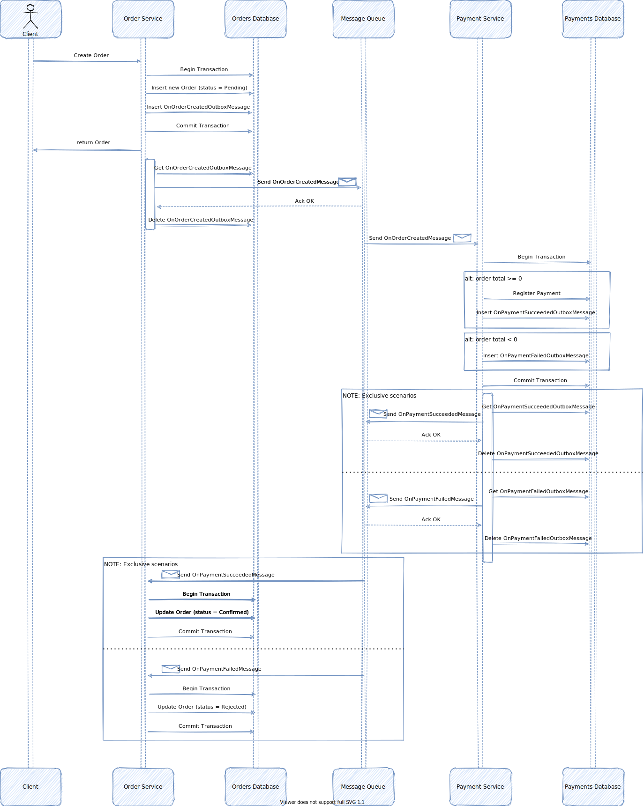

# Create-Order Saga Sample

This sample is meant to demonstrate the usage of ZapMicro.TransactionalOutbox library and should not be used for production purposes.

## Table of contents

1. [Requirements](#requirements)
2. [Architecture](#architecture)
3. [Run the sample](#run-the-sample)
4. [Run the test](#run-the-test)

## Requirements

In order to run the sample you need to install `docker` and `docker-compose`.
If you are running docker on windows be sure to use Linux containers.

## Architecture

 ***Figure 1**: create-order saga sample*

## Run the sample

The system can be run using the following:
```
cd ./samples/create-order-saga
docker-compose build
docker-compose up -d
```

To create an order use the following:
```
curl --location --request POST 'http://localhost:8000/order' \
--header 'Content-Type: application/json' \
--data-raw '{
    "Lines":[
        {
            "Adjustments": [],
            "ProductId": "product-1",
            "ProductPrice": 3,
            "ProductQuantity":4
        }
    ],
    "Adjustments":[
        {
            "OfferId":"offer1",
            "Total": -1
        }
    ]
}'
```

To get an existing order use the following:
```
curl --location --request GET 'http://localhost:8000/order/<order-id>'
```

where <order-id> is the id of an order which has been previously created.


## Run the test

The test executes the following steps:

1. Creates an order with total >= 0
2. Awaits for 5 seconds
3. Gets the order
4. Verifies that the order status is Confirmed
5. Creates an order with total < 0
6. Awaits for 5 seconds
7. Gets the order
8. Verifies that the order status is Rejected

The test can be run using the following commands:

```
cd ./samples/create-order-saga
docker-compose build
docker-compose run test-runner /bin/sh -c "dotnet ZapMicro.TransactionalOutbox.Samples.CreateOrderSaga.TestRunner.dll"
```